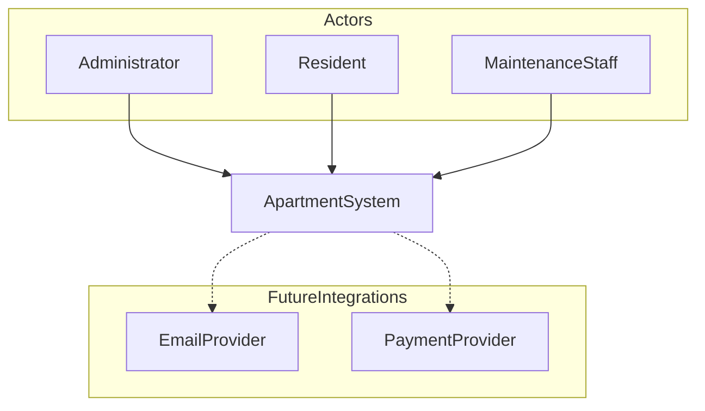
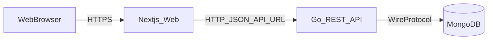
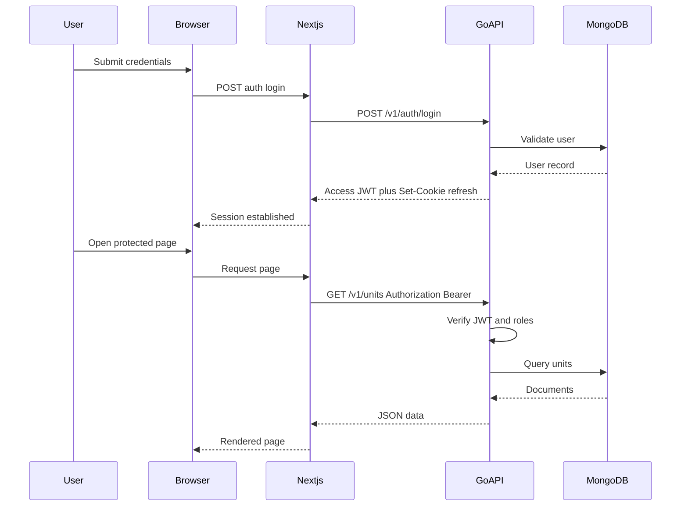
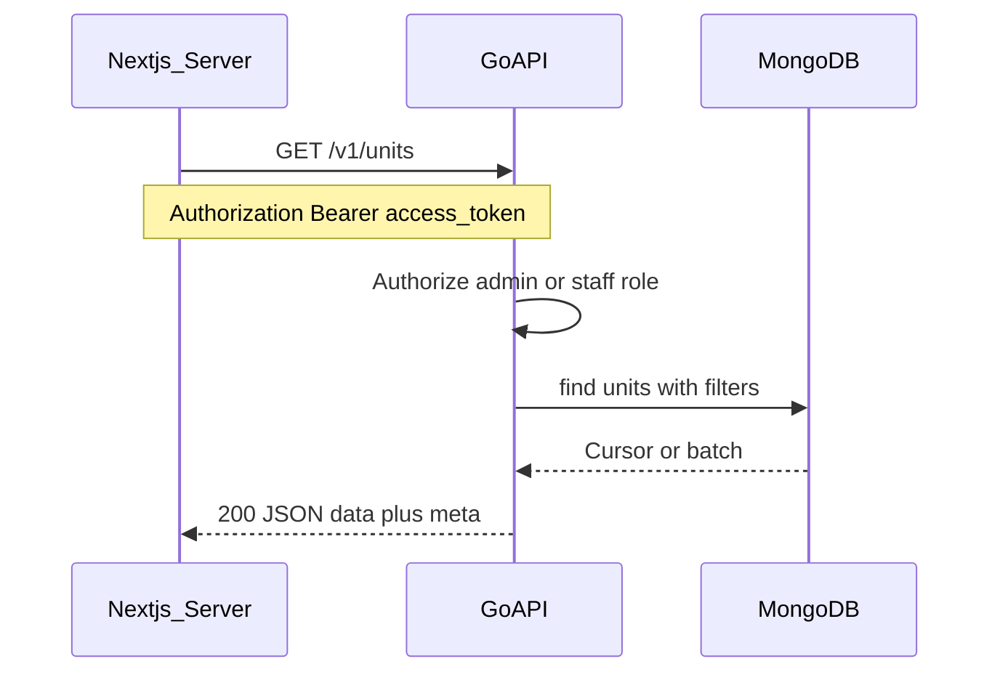
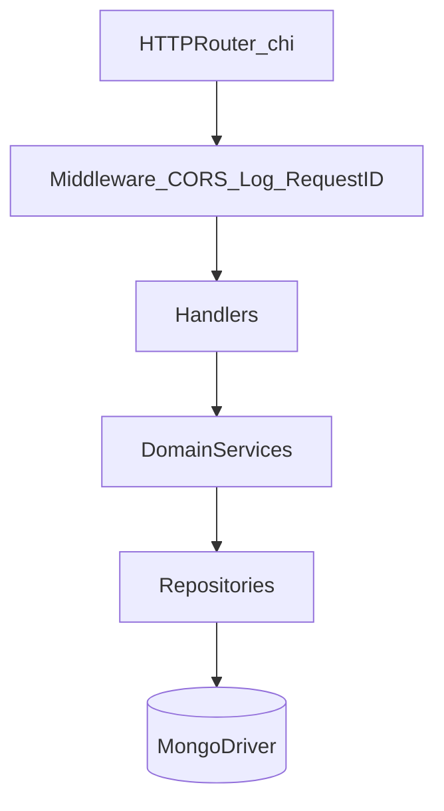
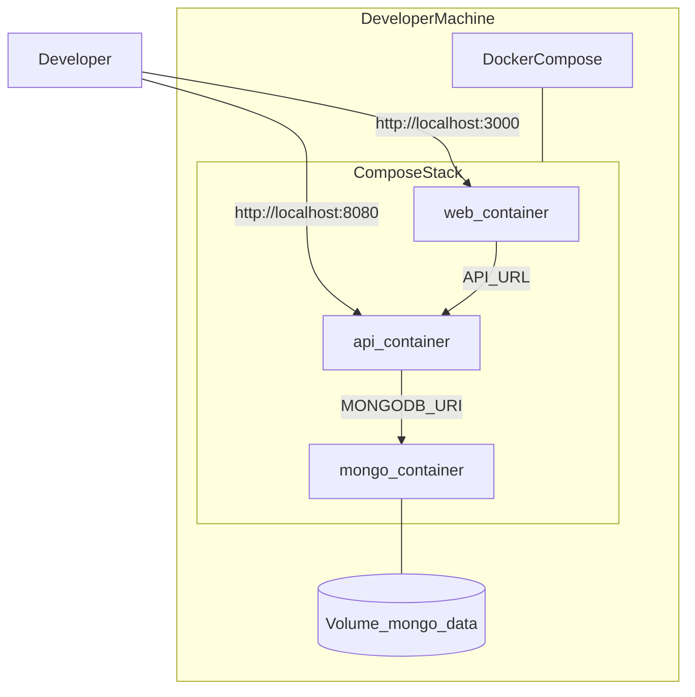
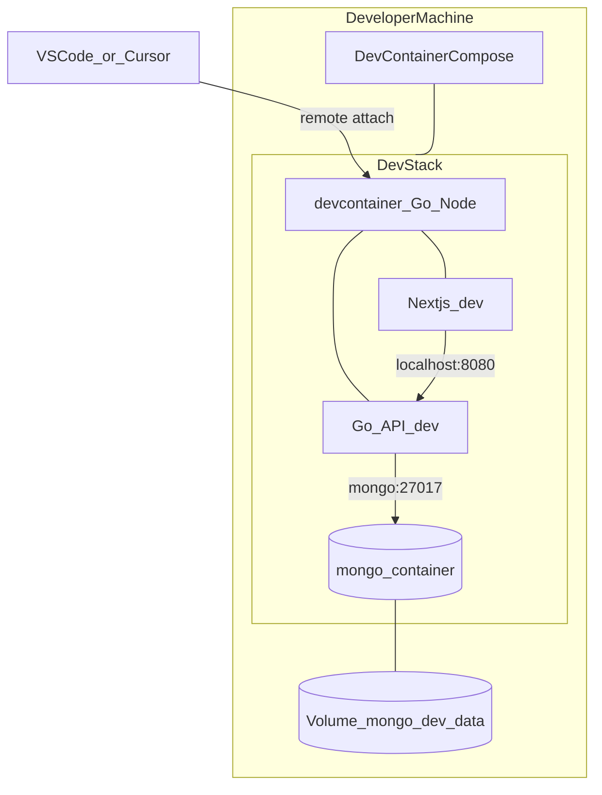
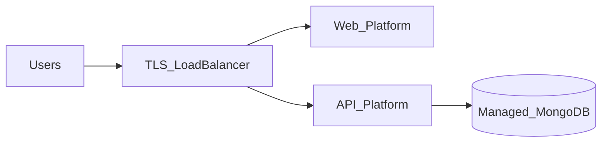

# Diagrams

Mermaid diagrams for the Apartment System. They render on GitHub, GitLab, and many Markdown preview tools.

---

## C4 — System context (Level 1)

Actors and the software system under construction.

---

## C4 — Containers (Level 2)

Major runnable/deployable pieces.

---

## Sequence — Login and authorized request (target behavior)

Illustrates the **recommended** JWT access + refresh pattern described in [api-overview.md](./api-overview.md). Implementation is future work.

---

## Sequence — List units (authenticated CRUD example)

Concrete example of an authorized read after tokens are in place.

---

## Go API — Internal components (conceptual)

Logical layering inside the Go service.

---

## Deployment — Docker Compose (development)

---

## Deployment — Dev Container (development)

Optional workflow: MongoDB and a **devcontainer** (Go + Node via features) share a Compose network; the editor attaches to the devcontainer. You can run the Go API and Next.js dev servers **inside** the devcontainer (`MONGODB_URI` → `mongo:27017`) or on the **host** (`localhost:27017`).

---

## Future production deployment (reference)

Not implemented in this repository; shown for planning.

