# Apartment System — รายงานการนำเสนอ (Presentation Report)

**โปรเจกต์:** ระบบจัดการอพาร์ตเมนต์ (Apartment System)  
**วันที่:** 17 พฤษภาคม 2026  
**รูปแบบ:** ตามกรอบการนำเสนอ 7 หัวข้อ (Requirement → Architecture → Implementation → Problem/Solution → Demo → Design Decisions → Summary)

> เปิดไฟล์นี้ด้วย **Markdown Preview** ใน Cursor / VS Code หรือบน GitHub เพื่อดูไดอะแกรม Mermaid และรูปภาพ

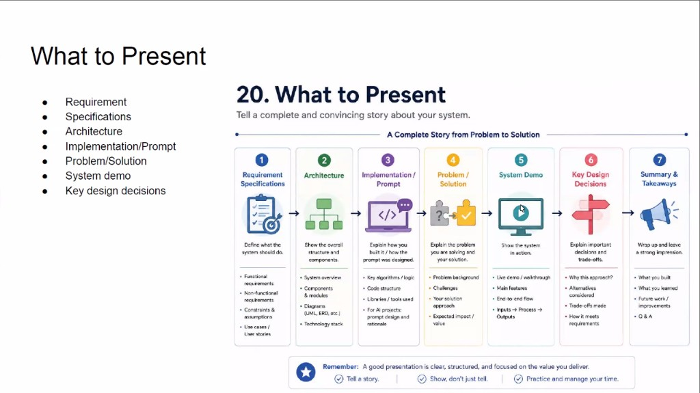

---

## สารบัญ

1. [Requirement Specifications](#1-requirement-specifications)
2. [Architecture](#2-architecture)
3. [Implementation](#3-implementation)
4. [Problem / Solution](#4-problem--solution)
5. [System Demo](#5-system-demo)
6. [Key Design Decisions](#6-key-design-decisions)
7. [Summary & Takeaways](#7-summary--takeaways)

---

# 1. Requirement Specifications

**เป้าหมาย:** กำหนดว่าระบบต้องทำอะไร — ขอบเขต ข้อจำกัด และกรณีใช้งาน

## 1.1 บริบทและวัตถุประสงค์

ระบบ **Apartment System** พัฒนาเพื่อช่วย**เจ้าของ/ผู้ดูแลอาคาร**และ**ผู้อยู่อาศัย**จัดการข้อมูลห้อง สัญญาเช่า การเงิน และงานซ่อมบำรุงผ่านเว็บแอปเดียว แทนการทำงานแยกสเปรดชีต กระดาษ หรือแชท

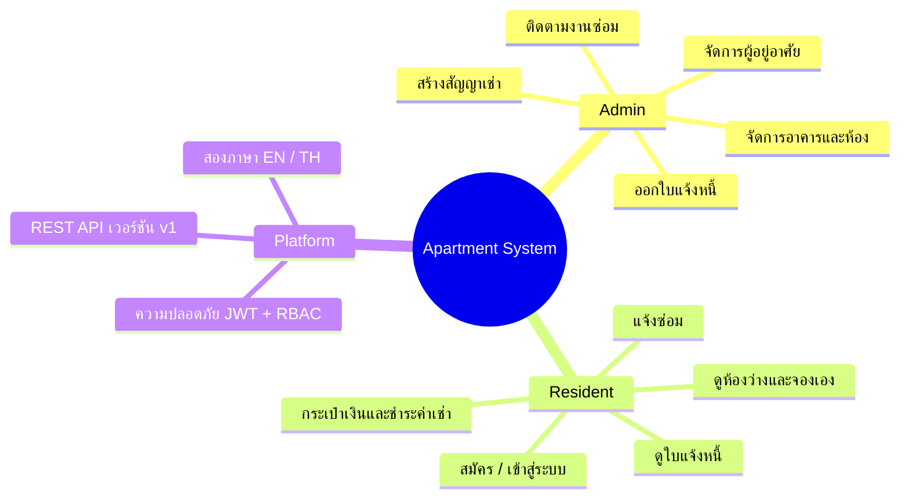
```mermaid
mindmap
  root((Apartment System))
    Admin
      จัดการอาคารและห้อง
      จัดการผู้อยู่อาศัย
      สร้างสัญญาเช่า
      ออกใบแจ้งหนี้
      ติดตามงานซ่อม
    Resident
      สมัคร / เข้าสู่ระบบ
      ดูห้องว่างและจองเอง
      กระเป๋าเงินและชำระค่าเช่า
      ดูใบแจ้งหนี้
      แจ้งซ่อม
    Platform
      REST API เวอร์ชัน v1
      ความปลอดภัย JWT + RBAC
      สองภาษา EN / TH
```

## 1.2 Functional Requirements (ความต้องการเชิงฟังก์ชัน)

| รหัส | ความต้องการ | สถานะในระบบ |
|------|-------------|:-----------:|
| FR-01 | ผู้ดูแล CRUD อาคาร (properties) | ✅ |
| FR-02 | ผู้ดูแล CRUD ห้อง (units) พร้อมสถานะ vacant/occupied/maintenance | ✅ |
| FR-03 | ผู้ดูแล CRUD ผู้อยู่อาศัย (residents) | ✅ |
| FR-04 | ผู้ดูแลสร้าง/แก้ไข/ยุติสัญญาเช่า (leases) | ✅ |
| FR-05 | ผู้อยู่อาศัยสมัครบัญชี / login (email+password, Google OAuth) | ✅ |
| FR-06 | ผู้อยู่อาศัยดูห้องว่างและจองห้องเอง (self-service lease) | ✅ |
| FR-07 | หักค่าเช่าเดือนแรกจาก wallet เมื่อจองสำเร็จ | ✅ |
| FR-08 | กระเป๋าเงิน: เติมเงิน โอน ดูยอด | ✅ |
| FR-09 | ใบแจ้งหนี้รายเดือน (billing job) | ✅ |
| FR-10 | แจ้งซ่อมพร้อมรูปภาพ | ✅ |
| FR-11 | อัปโหลดรูป property/unit/media | ✅ |
| FR-12 | พนักงานซ่อม (staff) — workflow เต็มรูปแบบ | ⏳ เตรียม role ไว้ |

## 1.3 Non-Functional Requirements (ความต้องการเชิงคุณภาพ)

| หมวด | รายละเอียด |
|------|------------|
| **ความปลอดภัย** | JWT access + refresh; RBAC (`admin`, `resident`); ไม่ใส่ secret ใน `NEXT_PUBLIC_*` |
| **ประสิทธิภาพ** | Go API binary เดียว; connection pool MongoDB; pagination แบบ cursor (ตามแผน API) |
| **ความน่าเชื่อถือ** | Transaction MongoDB เมื่อจองห้อง + หัก wallet + อัปเดต unit |
| **การสังเกตการณ์** | Structured JSON logs; `GET /health` รวมสถานะ MongoDB |
| **การใช้งาน** | UI สองภาษา (EN/TH) ผ่าน `next-intl` |
| **การ deploy** | Docker Compose สำหรับ dev; Dev Container สำหรับทีมพัฒนา |

## 1.4 Constraints & Assumptions (ข้อจำกัดและสมมติฐาน)

| ข้อจำกัด / สมมติฐาน | รายละเอียด |
|---------------------|------------|
| Monorepo | `apps/web` + `services/api` ใน repo เดียว |
| ฐานข้อมูล | MongoDB document model — ไม่ใช้ RDBMS |
| ชำระเงินจริง | Wallet ในระบบ (satang/THB) — **ยังไม่**เชื่อม payment gateway ภายนอก |
| Production | ยังเน้น dev/staging; hardening TLS และ managed DB เป็นงานถัดไป |
| หลายอาคาร | รองรับ `properties` หลายรายการ; มี `defaultPropertyId` สำหรับ self-service |

## 1.5 Use Cases / User Stories

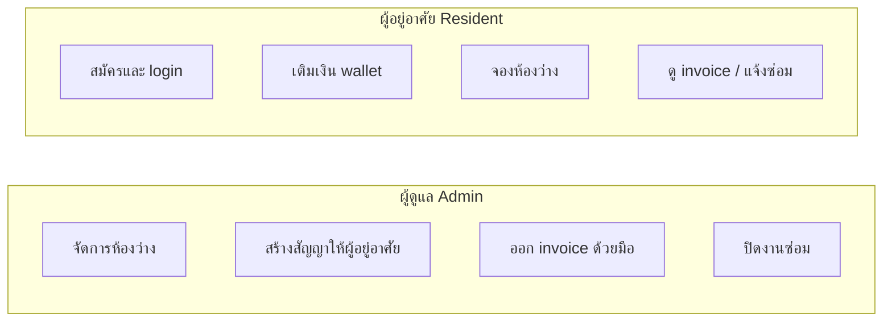
```mermaid
flowchart LR
  subgraph UC_Admin [ผู้ดูแล Admin]
    A1[จัดการห้องว่าง]
    A2[สร้างสัญญาให้ผู้อยู่อาศัย]
    A3[ออก invoice ด้วยมือ]
    A4[ปิดงานซ่อม]
  end
  subgraph UC_Resident [ผู้อยู่อาศัย Resident]
    R1[สมัครและ login]
    R2[เติมเงิน wallet]
    R3[จองห้องว่าง]
    R4[ดู invoice / แจ้งซ่อม]
  end
```

**User Story ตัวอย่าง (Resident):**

> *ในฐานะผู้อยู่อาศัย ฉันต้องการดูห้องว่างที่มีราคาเช่า แล้วจองห้องได้ทันที โดยหักค่าเช่าเดือนแรกจาก wallet เพื่อไม่ต้องรอ admin สร้างสัญญาให้*

**User Story ตัวอย่าง (Admin):**

> *ในฐานะผู้ดูแล ฉันต้องการเห็นภาพรวมห้อง สัญญา และคำขอซ่อมในที่เดียว เพื่อบริหารอาคารได้เร็วขึ้น*

---

# 2. Architecture

**เป้าหมาย:** แสดงโครงสร้างภาพรวม ส่วนประกอบ ไดอะแกรม และ technology stack

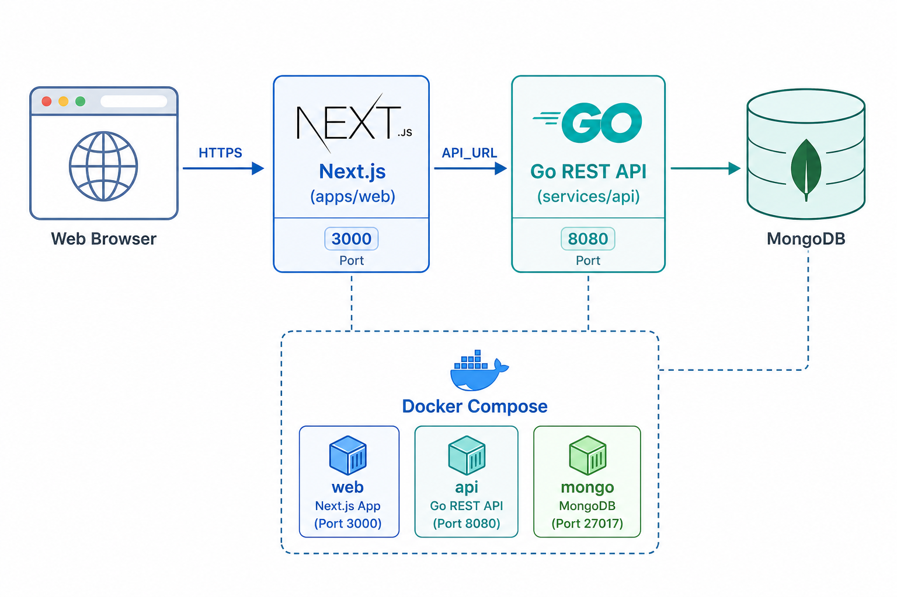

## 2.1 System Overview (C4 Level 1)

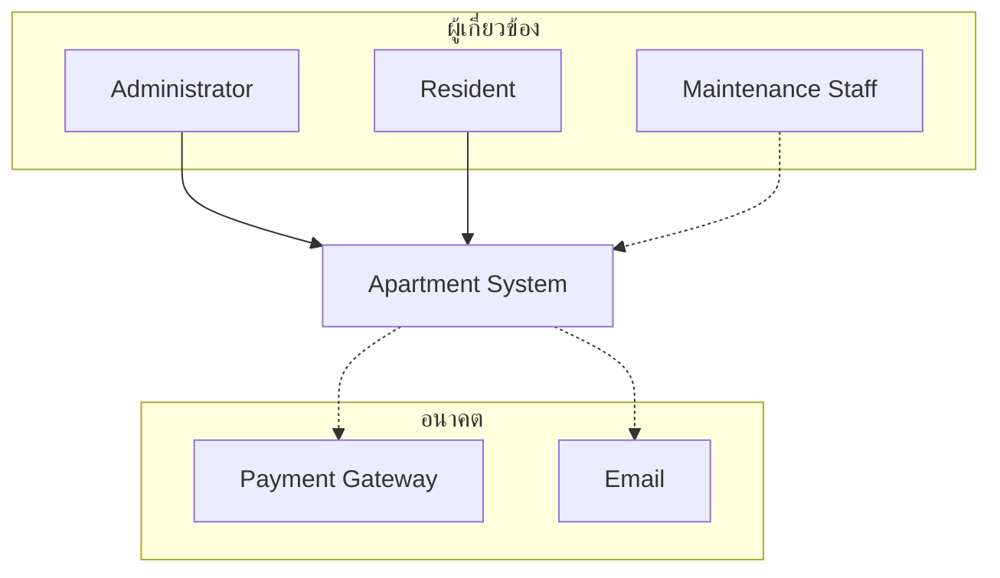
```mermaid
flowchart TB
  subgraph actors [ผู้เกี่ยวข้อง]
    Admin[Administrator]
    Resident[Resident]
    Staff[Maintenance Staff]
  end
  Sys[Apartment System]
  subgraph ext [อนาคต]
    Pay[Payment Gateway]
    Mail[Email]
  end
  Admin --> Sys
  Resident --> Sys
  Staff -.-> Sys
  Sys -.-> Pay
  Sys -.-> Mail
```

## 2.2 Containers (C4 Level 2)

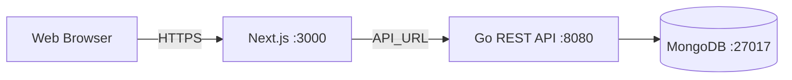
```mermaid
flowchart LR
  Browser[Web Browser]
  Next[Next.js :3000]
  API[Go REST API :8080]
  DB[(MongoDB :27017)]
  Browser -->|HTTPS| Next
  Next -->|API_URL| API
  API --> DB
```

| Container | Path | หน้าที่ |
|-----------|------|--------|
| **Web** | `apps/web` | UI, SSR, Server Actions, i18n |
| **API** | `services/api` | REST `/v1`, auth, business rules |
| **Database** | MongoDB | properties, units, leases, wallets, … |

## 2.3 Components & Modules (Go API)

```mermaid
flowchart TB
  subgraph transport [HTTP Layer]
    Chi[chi Router]
    MW[Auth / CORS / RequestID]
    H[Handlers]
  end
  subgraph domain [Domain Services]
    P[property] U[unit] R[resident]
    L[lease] M[maintenance]
    W[wallet] I[invoice] A[auth]
  end
  Repo[Repositories]
  Mongo[(MongoDB)]
  Bill[billing.Runner]
  Chi --> MW --> H --> domain --> Repo --> Mongo
  Bill --> L
  Bill --> I
```

## 2.4 Data Model (ER — สรุป)

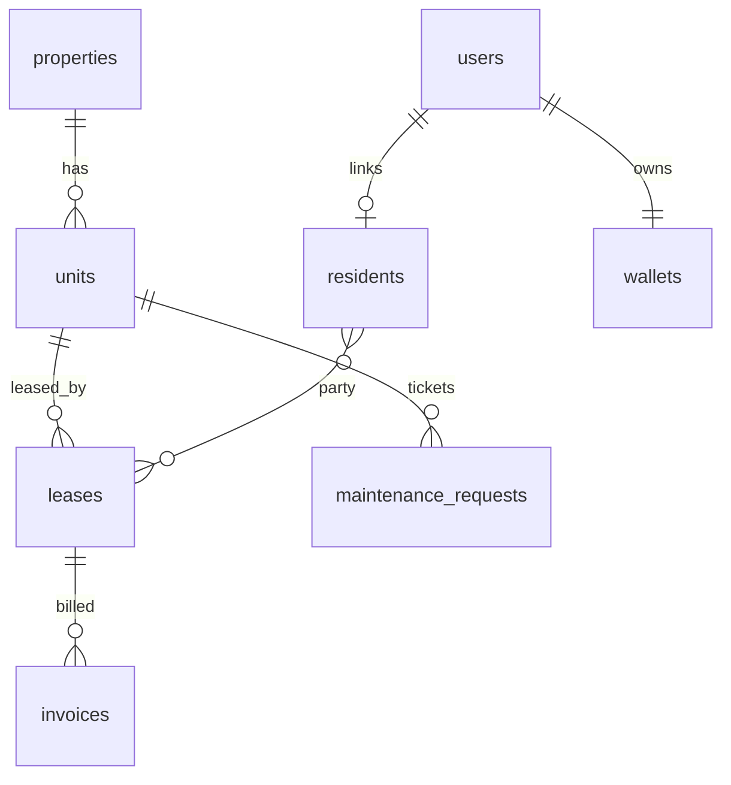
```mermaid
erDiagram
  properties ||--o{ units : has
  units ||--o{ leases : leased_by
  residents }o--o{ leases : party
  users ||--o| residents : links
  users ||--|| wallets : owns
  leases ||--o{ invoices : billed
  units ||--o{ maintenance_requests : tickets
```

## 2.5 Technology Stack

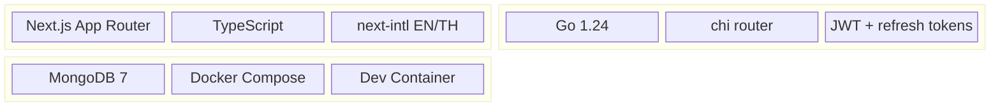
```mermaid
block-beta
  columns 3
  block:Frontend:2
    Next["Next.js  App Router"]
    TS["TypeScript"]
    Intl["next-intl EN/TH"]
  end
  block:Backend:2
    Go["Go 1.24"]
    Chi["chi router"]
    JWT["JWT + refresh tokens"]
  end
  block:DataOps:2
    Mongo["MongoDB 7"]
    Docker["Docker Compose"]
    DevC["Dev Container"]
  end
```

| ชั้น | เทคโนโลยี |
|------|-----------|
| Frontend | Next.js, TypeScript, Tailwind, next-intl |
| Backend | Go, chi, go-chi/cors, official MongoDB driver |
| Data | MongoDB (`apartment_system`) |
| DevOps | `docker-compose.yml`, `deploy/docker/`, `.devcontainer/` |
| AI / DX | `.cursor/rules`, `.cursor/skills/apartment-system` |

## 2.6 Deployment (Development)

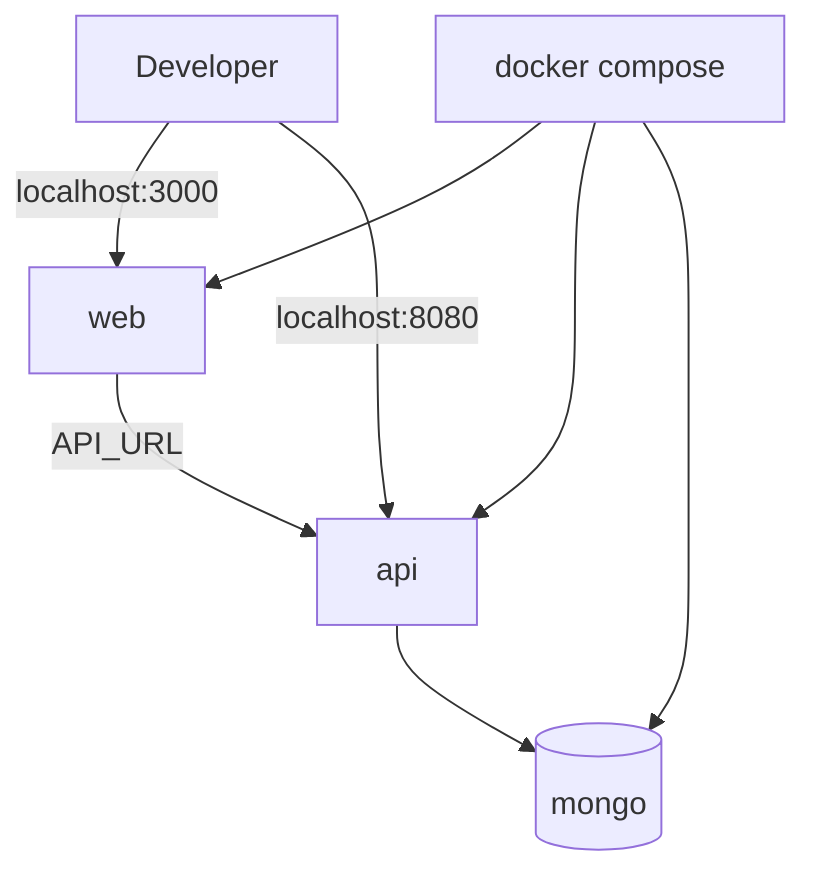
```mermaid
flowchart TB
  Dev[Developer]
  DC[docker compose]
  W[web]
  A[api]
  M[(mongo)]
  Dev -->|localhost:3000| W
  Dev -->|localhost:8080| A
  DC --> W
  DC --> A
  DC --> M
  W -->|API_URL| A
  A --> M
```

---

# 3. Implementation

**เป้าหมาย:** อธิบายว่าสร้างอย่างไร — โครงโค้ด อัลกอริทึม/logic หลัก และเครื่องมือ

## 3.1 Repository Layout

```
Apartment-System/
├── apps/web/                 # Next.js UI
│   ├── app/[locale]/         # routes: auth, dashboard, my
│   ├── components/           # UI components
│   ├── lib/                  # API client, auth, domain helpers
│   └── messages/             # en.json, th.json
├── services/api/
│   ├── cmd/server/main.go    # composition root
│   └── internal/             # domain + httpserver
├── deploy/docker/            # Dockerfiles
├── docs/                     # design docs + รายงานนี้
└── .cursor/                  # AI rules & skill
```

## 3.2 Go Layering (Handler → Service → Repository)

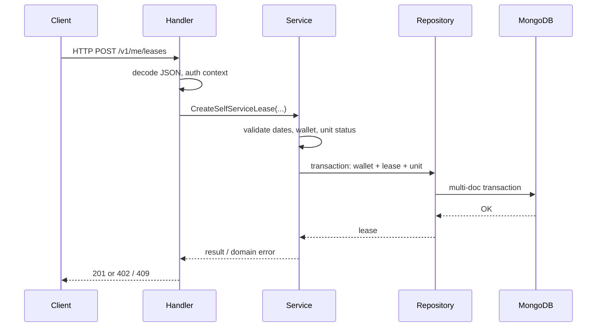
```mermaid
sequenceDiagram
  participant C as Client
  participant H as Handler
  participant S as Service
  participant R as Repository
  participant D as MongoDB

  C->>H: HTTP POST /v1/me/leases
  H->>H: decode JSON, auth context
  H->>S: CreateSelfServiceLease(...)
  S->>S: validate dates, wallet, unit status
  S->>R: transaction: wallet + lease + unit
  R->>D: multi-doc transaction
  D-->>R: OK
  R-->>S: lease
  S-->>H: result / domain error
  H-->>C: 201 or 402 / 409
```

**หลักการ:** Handler บาง — Service รวมกฎธุรกิจ — Repository รับผิดชอบ query/transaction เท่านั้น

## 3.3 Key Algorithms / Logic

### 3.3.1 Self-service lease + wallet gate

1. ตรวจว่าผู้อยู่อาศัยยังไม่มี lease `active`
2. ตรวจ unit: `vacant`, `listingRent.amount > 0`, `selfServiceEnabled != false`
3. คำนวณค่าเช่าเดือนแรก (จาก `listingRent` หรือ period offer)
4. **Transaction:** หัก wallet → สร้าง lease `active` → unit `occupied` → ตั้ง `primaryUnitId`

### 3.3.2 Billing รายเดือน

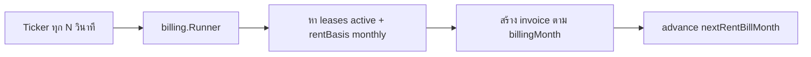
```mermaid
flowchart LR
  T[Ticker ทุก N วินาที] --> R[billing.Runner]
  R --> Q[หา leases active + rentBasis monthly]
  Q --> I[สร้าง invoice ตาม billingMonth]
  I --> N[advance nextRentBillMonth]
```

Idempotency: index แบบ unique บน `(leaseId, billingMonth)` ป้องกัน invoice ซ้ำ

### 3.3.3 Authentication

- `POST /v1/auth/login` → access JWT (สั้น) + refresh token (เก็บฝั่ง server/cookie)
- Middleware `bearerAuth` + `mustRole(admin|resident)`
- Next.js: Server Actions / session ไม่ expose refresh ไป client โดยไม่จำเป็น

## 3.4 Libraries & Tools

| ส่วน | Library / Tool |
|------|----------------|
| Go routing | `github.com/go-chi/chi/v5` |
| CORS | `github.com/go-chi/cors` |
| MongoDB | `go.mongodb.org/mongo-driver` |
| Env | `github.com/joho/godotenv` |
| Next.js | App Router, Server Components |
| i18n | `next-intl` |
| Live reload API | `air` (optional) |
| Container | Docker, Dev Container features (Go 1.24, Node 22) |

## 3.5 Cursor / AI-assisted development

โปรเจกต์ใช้ **`.cursor/skills/apartment-system/SKILL.md`** เป็นแหล่งความรู้สำหรับ agent:

- design-first อ่าน `docs/architecture.md`, `data-model.md` ก่อนแก้
- บังคับเลเยอร์ Go และไม่ duplicate business rules ใน Next.js
- กฎใน `.cursor/rules/apartment-system.mdc` apply ทุก session

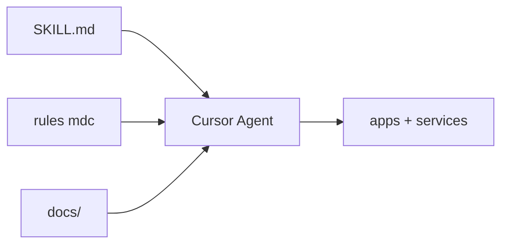
```mermaid
flowchart LR
  Skill[SKILL.md] --> Agent[Cursor Agent]
  Rule[rules mdc] --> Agent
  Agent --> Code[apps + services]
  Docs[docs/] --> Agent
```

---

# 4. Problem / Solution

**เป้าหมาย:** อธิบายปัญหา ความท้าทาย แนวทางแก้ และคุณค่าที่ได้

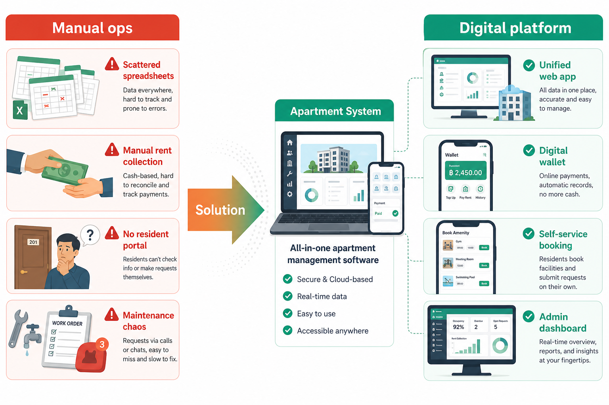

## 4.1 Problem Background (ภูมิหลังปัญหา)

การบริหารอพาร์ตเมนต์ขนาดเล็กถึงกลางมักพึ่ง:

- สมุด/Excel แยกไฟล์ — ข้อมูลไม่ sync
- ผู้อยู่อาศัยติดต่อจองห้องผ่านโทร/แชท — ช้าและผิดพลาดได้
- เก็บค่าเช่าและออกใบแจ้งหนี้ด้วยมือ — ติดตามยาก
- งานซ่อมกระจัดกระจาย — ไม่มีสถานะกลาง

## 4.2 Challenges (ความท้าทาย)

| ความท้าทาย | รายละเอียด |
|------------|------------|
| **ความสอดคล้องของข้อมูล** | จองห้องซ้ำ หรือ unit ยัง vacant แต่มีคนอยู่แล้ว |
| **การเงิน** | ต้องมั่นใจว่ามีเงินก่อนสร้างสัญญา self-service |
| **ความปลอดภัย** | แยกสิทธิ์ admin vs resident ชัดเจน |
| **การขยายระบบ** | รองรับหลาย property โดยไม่ rewrite |
| **ประสบการณ์ผู้ใช้** | ภาษาไทย/อังกฤษ และ mobile-friendly |

## 4.3 Solution Approach (แนวทางแก้)

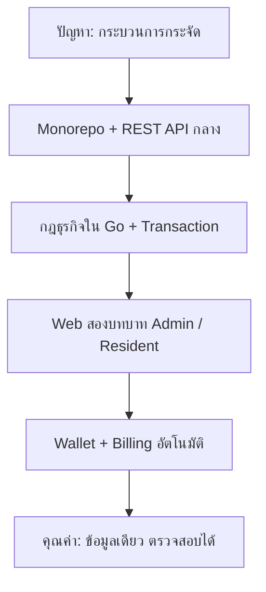
```mermaid
flowchart TB
  P[ปัญหา: กระบวนการกระจัด] --> S1[Monorepo + REST API กลาง]
  S1 --> S2[กฎธุรกิจใน Go + Transaction]
  S2 --> S3[Web สองบทบาท Admin / Resident]
  S3 --> S4[Wallet + Billing อัตโนมัติ]
  S4 --> V[คุณค่า: ข้อมูลเดียว ตรวจสอบได้]
```

| มิติ | วิธีแก้ในระบบนี้ |
|------|------------------|
| ข้อมูลกลาง | MongoDB + API เวอร์ชัน `/v1` |
| จองห้อง | Self-service + transaction หัก wallet |
| สิทธิ์ | JWT + RBAC middleware |
| UX | พอร์ทัล `/my/*` สำหรับ resident, dashboard สำหรับ admin |

## 4.4 Expected Impact / Value (ผลกระทบที่คาดหวัง)

| ผู้มีส่วนได้ส่วนเสีย | คุณค่า |
|---------------------|--------|
| **Admin** | ลดงาน manual สร้างสัญญา; เห็นสถานะห้องและซ่อมรวมศูนย์ |
| **Resident** | จองห้องและจ่ายเดือนแรกได้ทันที; ติดตาม invoice และแจ้งซ่อม online |
| **ทีมพัฒนา** | Monorepo + docs + Docker — onboard และ deploy dev ง่าย |

---

# 5. System Demo

**เป้าหมาย:** แสดงระบบทำงาน — ฟีเจอร์หลัก และ flow ต้นท้าย

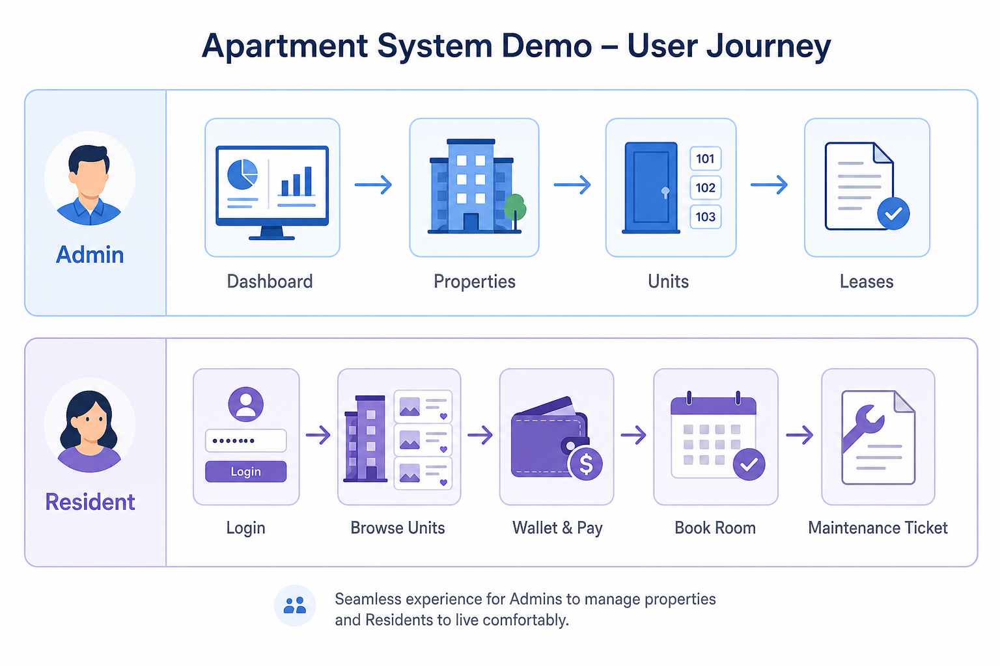

> **หมายเหตุการ demo สด:** รัน `docker compose up --build` หรือ `npm run dev` + `go run ./cmd/server` แล้วเปิด `http://localhost:3000`

## 5.1 บทบาทและ URL หลัก

| บทบาท | URL ตัวอย่าง | ฟีเจอร์ |
|--------|-------------|---------|
| ทุกคน | `/login`, `/register` | เข้าสู่ระบบ, สมัคร resident, Google OAuth |
| **Admin** | `/dashboard` | สถิติภาพรวม |
| Admin | `/properties`, `/units`, `/residents`, `/leases` | CRUD + รายละเอียด |
| Admin | `/maintenance`, `/wallet` | คิวซ่อม, กระเป๋า |
| **Resident** | `/my` | หน้าแรกสรุป |
| Resident | `/my/rent` | ดูห้องว่าง → จอง |
| Resident | `/my/wallet` | เติมเงิน / โอน |
| Resident | `/my/invoices` | ใบแจ้งหนี้ |
| Resident | `/my/maintenance` | แจ้งซ่อม + รูป |

## 5.2 End-to-End Flow — Resident จองห้อง

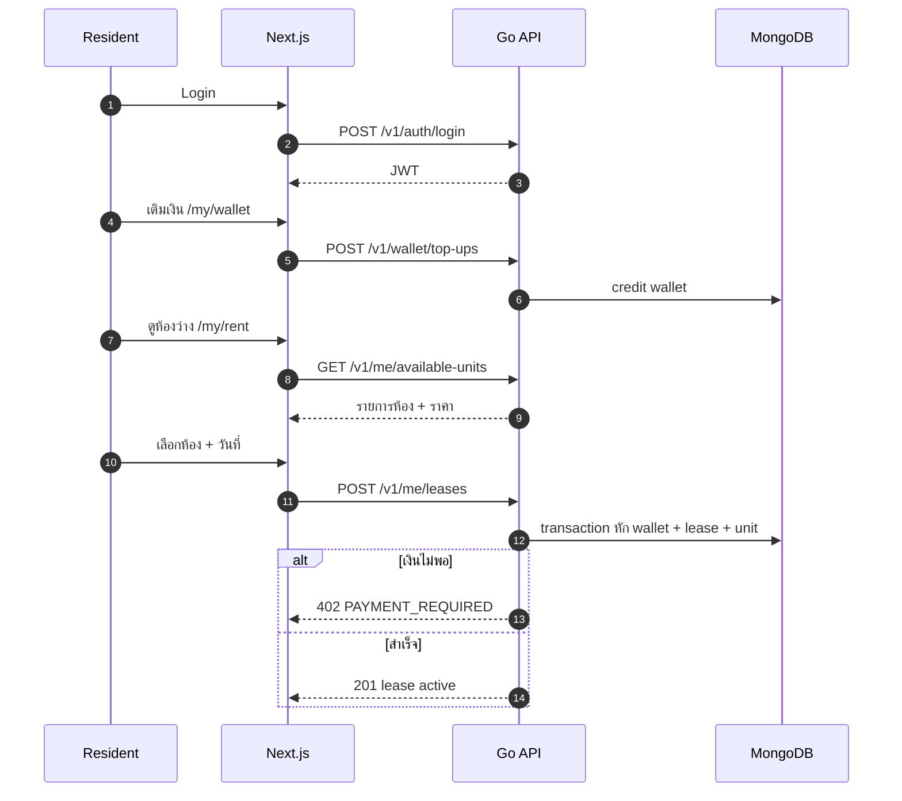
```mermaid
sequenceDiagram
  autonumber
  participant U as Resident
  participant Web as Next.js
  participant API as Go API
  participant DB as MongoDB

  U->>Web: Login
  Web->>API: POST /v1/auth/login
  API-->>Web: JWT

  U->>Web: เติมเงิน /my/wallet
  Web->>API: POST /v1/wallet/top-ups
  API->>DB: credit wallet

  U->>Web: ดูห้องว่าง /my/rent
  Web->>API: GET /v1/me/available-units
  API-->>Web: รายการห้อง + ราคา

  U->>Web: เลือกห้อง + วันที่
  Web->>API: POST /v1/me/leases
  API->>DB: transaction หัก wallet + lease + unit
  alt เงินไม่พอ
    API-->>Web: 402 PAYMENT_REQUIRED
  else สำเร็จ
    API-->>Web: 201 lease active
  end
```

**Input → Process → Output**

| ขั้น | Input | Process | Output |
|------|-------|---------|--------|
| 1 | email/password | auth service | JWT + session |
| 2 | จำนวนเงิน | wallet top-up | balance เพิ่ม |
| 3 | unitId, วันที่ | self-service lease | lease active, unit occupied |
| 4 | (เวลาผ่านไป) | billing ticker | invoice รายเดือน |

## 5.3 End-to-End Flow — Admin จัดการห้อง

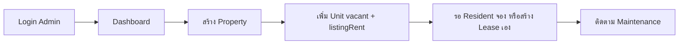
```mermaid
flowchart LR
  A[Login Admin] --> D[Dashboard]
  D --> P[สร้าง Property]
  P --> U[เพิ่ม Unit vacant + listingRent]
  U --> W[รอ Resident จอง หรือสร้าง Lease เอง]
  W --> M[ติดตาม Maintenance]
```

## 5.4 Main Features (สรุปฟีเจอร์สำหรับสไลด์ Demo)

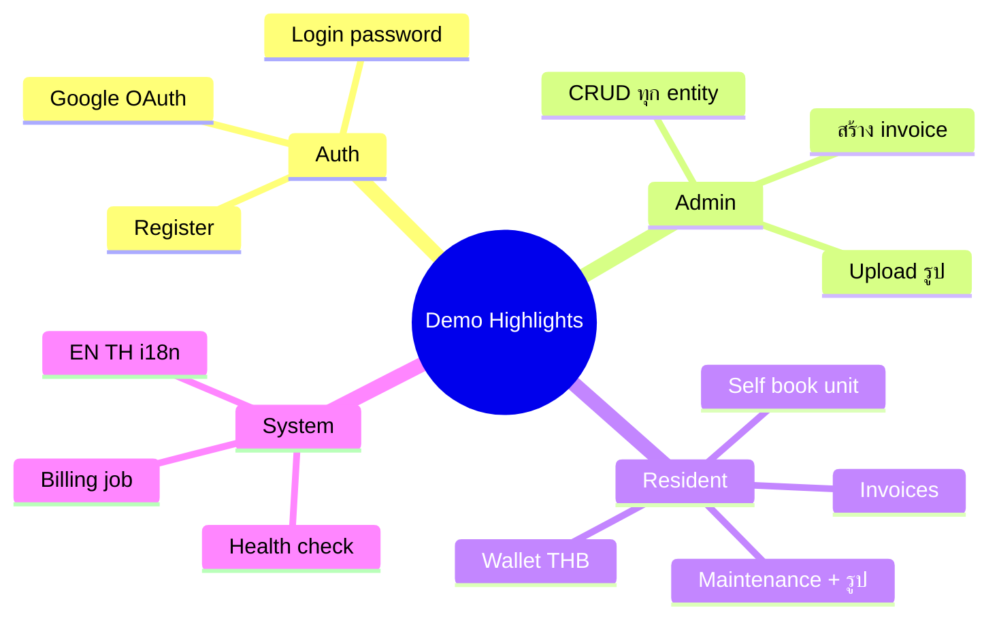
```mermaid
mindmap
  root((Demo Highlights))
    Auth
      Register
      Login password
      Google OAuth
    Admin
      CRUD ทุก entity
      Upload รูป
      สร้าง invoice
    Resident
      Self book unit
      Wallet THB
      Invoices
      Maintenance + รูป
    System
      Health check
      Billing job
      EN TH i18n
```

## 5.5 ตัวอย่าง API (สำหรับ demo ทางเทคนิค)

```bash
# Health (ไม่ต้อง auth)
curl http://localhost:8080/health

# Login
curl -X POST http://localhost:8080/v1/auth/login \
  -H "Content-Type: application/json" \
  -d '{"email":"...","password":"..."}'

# ห้องว่าง (Bearer token resident)
curl http://localhost:8080/v1/me/available-units \
  -H "Authorization: Bearer <access_token>"
```

---

# 6. Key Design Decisions

**เป้าหมาย:** อธิบายการตัดสินใจสำคัญ ทางเลือกที่พิจารณา และ trade-offs

## 6.1 สรุป ADR (Architecture Decision Records)

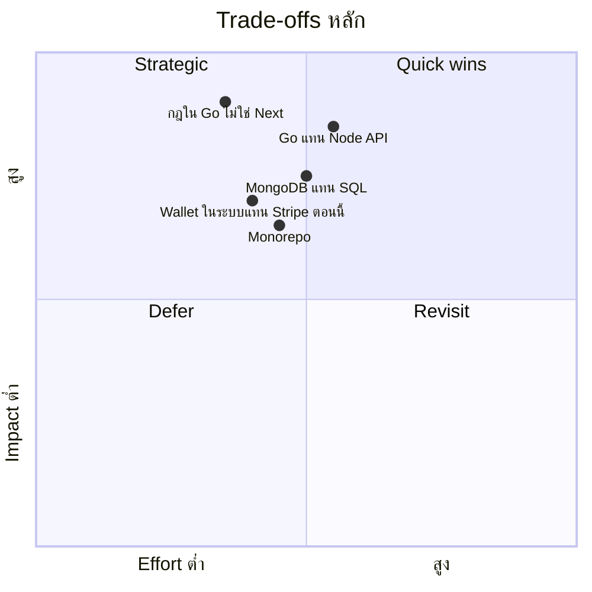
```mermaid
quadrantChart
  title Trade-offs หลัก
  x-axis Effort ต่ำ --> สูง
  y-axis Impact ต่ำ --> สูง
  quadrant-1 Quick wins
  quadrant-2 Strategic
  quadrant-3 Defer
  quadrant-4 Revisit
  Go แทน Node API: [0.55, 0.85]
  MongoDB แทน SQL: [0.5, 0.75]
  กฎใน Go ไม่ใช่ Next: [0.35, 0.9]
  Wallet ในระบบแทน Stripe ตอนนี้: [0.4, 0.7]
  Monorepo: [0.45, 0.65]
```

| ADR | การตัดสินใจ | เหตุผล | Trade-off |
|-----|-------------|--------|-----------|
| **ADR-1** | Next.js (App Router) | SSR, ecosystem, TypeScript | ต้องแยก `API_URL` vs `NEXT_PUBLIC_*` |
| **ADR-2** | Go + chi สำหรับ API | binary เดียว, performance, middleware ชัด | ทีมต้องคุ้น Go |
| **ADR-3** | MongoDB | schema ยืดหยุ่น ตรง domain document | ต้องออกแบบ index/transaction เอง |
| **ADR-4** | Docker Compose | dev parity ง่าย | production ยังต้องแยก manifest |
| **ADR-5** | กฎธุรกิจใน Go เท่านั้น | แหล่งความจริงเดียว ไม่ drift กับ UI | Next.js เป็น presentation + orchestration |
| **ADR-6** | JWT access + refresh | stateless access, revoke refresh ได้ | ซับซ้อนกว่า session cookie อย่างเดียว |
| **ADR-7** | Wallet ภายในระบบ | demo end-to-end ได้โดยไม่พึ่ง gateway | ไม่ใช่การชำระเงินจริงในธนาคาร |

## 6.2 ทางเลือกที่พิจารณาแล้วไม่เลือก (ตอนนี้)

| ทางเลือก | ทำไมไม่เลือกตอนนี้ |
|----------|---------------------|
| Next.js API Routes เป็น backend หลัก | ซ้ำกับ Go; กฎธุรกิจแตกสองที่ |
| PostgreSQL | ทีมเลือก document model สำหรับ MVP ที่เปลี่ยนบ่อย |
| Session cookie อย่างเดียว | JWT เหมาะกับ API + mobile/3rd party ในอนาคต |
| Payment gateway ตั้งแต่แรก | ขอบเขต MVP — wallet จำลองการหักเงิน |

## 6.3 การตอบสนองความต้องการ (Requirements Traceability)

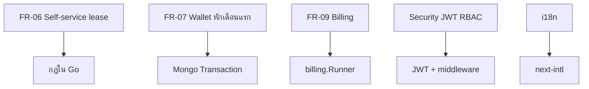
```mermaid
flowchart TB
  FR06[FR-06 Self-service lease] --> ADR5[กฎใน Go]
  FR07[FR-07 Wallet หักเดือนแรก] --> TX[Mongo Transaction]
  FR09[FR-09 Billing] --> JOB[billing.Runner]
  NFR01[Security JWT RBAC] --> ADR6[JWT + middleware]
  NFR05[i18n] --> Intl[next-intl]
```

---

# 7. Summary & Takeaways

**เป้าหมาย:** สรุปสิ่งที่สร้าง สิ่งที่เรียนรู้ งานอนาคต และ Q&A

## 7.1 What We Built (สิ่งที่สร้างได้)

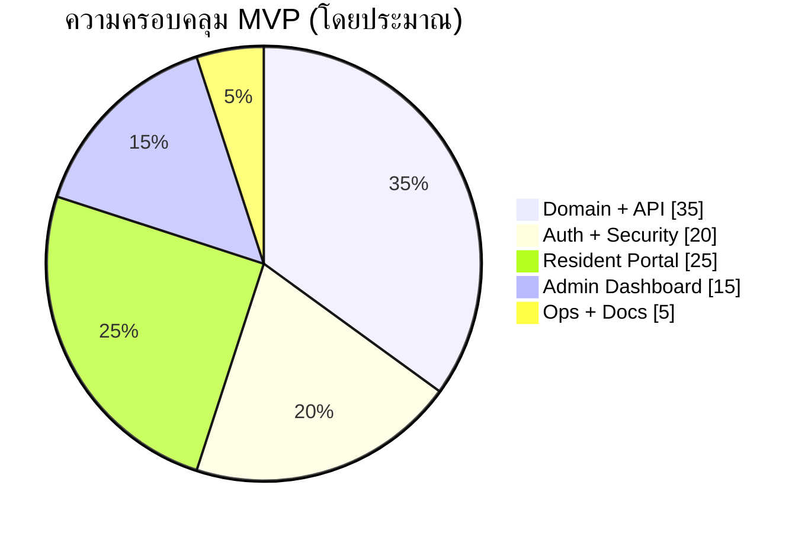
```mermaid
pie showData
  title ความครอบคลุม MVP (โดยประมาณ)
  "Domain + API" : 35
  "Auth + Security" : 20
  "Resident Portal" : 25
  "Admin Dashboard" : 15
  "Ops + Docs" : 5
```

| ส่วน | สรุป |
|------|------|
| **Backend** | Go REST API `/v1`, CRUD ครบ, auth, wallet, invoice, billing, media |
| **Frontend** | Next.js admin + resident portal, EN/TH |
| **Data** | MongoDB พร้อม indexes และ transaction จองห้อง |
| **DevOps** | Docker Compose, Dev Container, เอกสาร `docs/` |

## 7.2 What We Learned (สิ่งที่เรียนรู้)

- **เลเยอร์ชัด** (handler → service → repo) ช่วยให้เพิ่มฟีเจอร์ self-service และ billing โดยไม่กระจาย logic
- **Transaction** จำเป็นเมื่อ wallet + lease + unit ต้องสำเร็จพร้อมกัน
- **Design-first docs** + Cursor skill ลดการ implement ผิดขอบเขต
- **i18n ตั้งแต่ต้น** ถูกกว่าแปะภาษาทีหลัง

## 7.3 Future Work / Improvements

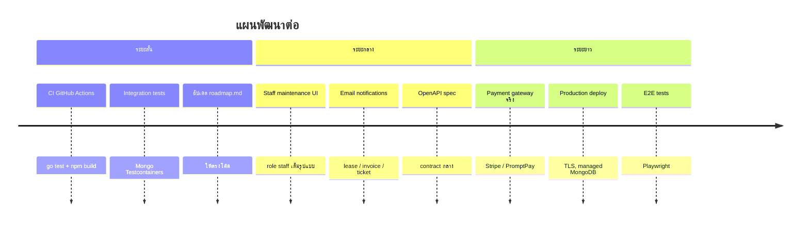
```mermaid
timeline
  title แผนพัฒนาต่อ
  section ระยะสั้น
    CI GitHub Actions : go test + npm build
    Integration tests : Mongo Testcontainers
    อัปเดต roadmap.md : ให้ตรงโค้ด
  section ระยะกลาง
    Staff maintenance UI : role staff เต็มรูปแบบ
    Email notifications : lease / invoice / ticket
    OpenAPI spec : contract กลาง
  section ระยะยาว
    Payment gateway จริง : Stripe / PromptPay
    Production deploy : TLS, managed MongoDB
    E2E tests : Playwright
```

| ลำดับ | งาน | เหตุผล |
|:-----:|-----|--------|
| 1 | GitHub Actions CI | คุณภาพและ merge ปลอดภัย |
| 2 | Integration / E2E tests | ครอบคลุม flow จองห้อง + wallet |
| 3 | Production hardening | JWT secret, TLS, MongoDB auth |
| 4 | Payment provider | ชำระเงินจริงนอก wallet |
| 5 | Staff workflows | ปิด gap role `staff` |

## 7.4 คำแนะนำการนำเสนอ (จากกรอบ 7 หัวข้อ)

1. **เล่าเป็นเรื่อง** — เริ่มจากปัญหา (§4) → แก้ด้วยอะไร (§2–3) → โชว์ demo (§5) → ปิดด้วยสรุป (§7)
2. **Show, don't just tell** — เปิด preview ไฟล์นี้ + รัน demo สด 2–3 นาที (login → จองห้อง หรือ admin สร้าง unit)
3. **จับเวลา** — แนะนำ ~2–3 นาที/หัวข้อ รวม ~15–20 นาที + Q&A

## 7.5 Q & A (คำถามที่อาจถูกถาม)

| คำถาม | คำตอบสั้น |
|--------|-----------|
| ทำไมใช้ Go ไม่ใช้ Node ทั้ง stack? | แยก concerns; API เป็น binary เร็ว; กฎธุรกิจรวมศูนย์ |
| ชำระเงินจริงได้ไหม? | ตอนนี้เป็น wallet ในระบบ — gateway เป็นงานถัดไป |
| รองรับหลายอาคารไหม? | รองรับหลาย `properties`; self-service ใช้ default property |
| พร้อม production ไหม? | MVP dev-ready — ต้อง CI, TLS, secrets, backup ก่อน go-live |
| ทดสอบอัตโนมัติมีไหม? | มี unit tests บางส่วนใน Go — ยังไม่มี CI/e2e เต็มรูปแบบ |

---

## ภาคผนวก — เอกสารและรูปภาพ

| ไฟล์ | คำอธิบาย |
|------|----------|
| [architecture-overview.png](./assets/architecture-overview.png) | ภาพสถาปัตยกรรม |
| [problem-solution.png](./assets/problem-solution.png) | ปัญหา → แนวทางแก้ |
| [demo-user-journey.png](./assets/demo-user-journey.png) | เส้นทาง Admin / Resident |
| [presentation-framework-7-steps.png](./assets/presentation-framework-7-steps.png) | กรอบ 7 หัวข้อที่อ้างอิง |
| [diagrams.md](./diagrams.md) | ไดอะแกรมมาตรฐานเพิ่มเติม |
| [architecture.md](./architecture.md) | ADR และ security |

---

*รายงานฉบับนี้จัดทำสำหรับการนำเสนอโปรเจกต์ Apartment System — อัปเดตล่าสุด 17 พฤษภาคม 2026*
