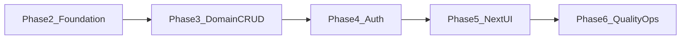

# Roadmap — next phases

This document turns the post-scaffold plan into an actionable sequence after **Phase 0** (monorepo, Docker, `/health`, and baseline docs). It complements [architecture.md](./architecture.md), [data-model.md](./data-model.md), and [api-overview.md](./api-overview.md).

## Current baseline (Phase 0)

- Next.js app in `apps/web` with server-side calls to the Go API.
- Go API with `GET /health`, MongoDB connectivity, CORS, structured logging.
- Docker Compose for `mongo`, `api`, and `web`.
- English design docs and Mermaid diagrams under `docs/`.

## Phase overview

Phases 4 and 5 can overlap in places (for example, UI prototypes before full auth), but the order below minimizes security gaps.

---

## Phase 2 — Foundation (API and MongoDB)

**Goal**: Make the Go service ready to grow in line with [api-overview.md](./api-overview.md).

| Item | Detail |
|------|--------|
| Database name | Use an explicit database in `MONGODB_URI` (for example `mongodb://host:27017/apartment_system`). Document in root `.env.example` and [README.md](../README.md). |
| Package layout | Introduce packages such as `internal/config`, `internal/db` (connect and ping), and a small HTTP helper package for consistent JSON responses. |
| Versioned API | Mount routes under `/v1`. Keep `GET /health` **unversioned** for probes. |
| Errors | Return the error JSON shape described in [api-overview.md](./api-overview.md); include the request ID from chi middleware where possible. |
| Seed placeholder | Add a `scripts/` or `deploy/` placeholder (script, Makefile target, or short README section) for future seed data, even if empty at first. |

**Primary touchpoint**: `services/api/cmd/server/main.go` (refactor into packages rather than growing the file indefinitely).

---

## Phase 3 — Domain CRUD (MongoDB and REST)

**Goal**: Implement the MVP domain from [data-model.md](./data-model.md).

Suggested order:

1. **Properties** and **units** — CRUD plus indexes (for example unique `(propertyId, label)` on units).
2. **Residents** — CRUD plus email uniqueness policy (global vs per property).
3. **Leases** — Create, update, end; validate state rules (for example at most one `active` lease per unit if that is a business rule).
4. **Optional**: **Maintenance requests** in the same handler → service → repository style.

Each resource should use pagination (cursor-based) as outlined in [api-overview.md](./api-overview.md). Update or add an OpenAPI spec under `docs/` if the team wants a single source of truth for paths and schemas.

---

## Phase 4 — Authentication and authorization

**Goal**: Match the approach documented in [api-overview.md](./api-overview.md): **short-lived JWT access tokens** and **refresh tokens** (or switch deliberately to httpOnly session cookies and update the docs to match).

| Item | Detail |
|------|--------|
| Identity storage | Collection for users or accounts; password hashing (for example Argon2 or bcrypt). |
| Endpoints | `POST /v1/auth/login`, `POST /v1/auth/refresh`, `POST /v1/auth/logout`; rotate refresh tokens if stored server-side. |
| Middleware | Validate JWT, attach `userId` and roles to request context. |
| RBAC | Minimum roles such as `admin`, `resident`, and `staff` as described in [architecture.md](./architecture.md). |

**Next.js**: Prefer Route Handlers or Server Actions as a boundary so tokens are not exposed to the browser unnecessarily.

---

## Phase 5 — Next.js product UI

**Goal**: Replace the health-only home page with real workflows.

- Navigation and layout split by role (admin vs resident, and staff if applicable).
- List and form views for properties, units, residents, and leases.
- Prefer server-side data fetching; use `NEXT_PUBLIC_API_URL` only where the browser must call the API directly.

---

## Phase 6 — Quality and operations

**Goal**: Close gaps explicitly deferred from Phase 0.

| Item | Detail |
|------|--------|
| Tests | Go: `httptest` plus integration tests (Testcontainers or a disposable MongoDB). Next: component or e2e tests as appropriate. |
| CI | GitHub Actions (or equivalent): `go test`, `npm run lint`, `npm run build`, `docker compose build`. |
| Developer experience | Optional Compose override profile: bind-mount `apps/web`, run `npm run dev`, and optionally live-reload Go (for example `air`). |

---

## Decisions to lock before deep implementation

These choices affect Phase 3 and Phase 4:

1. **Scope**: Multi-property from day one, or single-building (simplify or drop `properties` as noted in [data-model.md](./data-model.md)).
2. **Sign-in**: Email and password first, or OAuth (Google and others) as the primary path.

If you need a **single sprint** after Phase 0, a practical slice is **Phase 2** plus **properties and units** from Phase 3, optionally guarded by a **temporary API key** for development until Phase 4 is done.

---

## Related documents

- [architecture.md](./architecture.md) — containers and security boundaries.
- [api-overview.md](./api-overview.md) — REST and auth conventions.
- [data-model.md](./data-model.md) — collections and indexes.
- [diagrams.md](./diagrams.md) — existing architecture diagrams.
