# รายงานสถานะโปรเจกต์ Apartment System

> **สำหรับนำเสนอตามกรอบ 7 หัวข้อ** ใช้ **[presentation-report.md](./presentation-report.md)** แทนไฟล์นี้

**วันที่:** 17 พฤษภาคม 2026  
**ขอบเขต:** `.cursor` · `apps/web` · `deploy` · `docs` · `services/api`

> เปิดไฟล์นี้ใน GitHub, GitLab, หรือ Markdown preview ที่รองรับ Mermaid เพื่อดูไดอะแกรมแบบ interactive  
> รูปภาพประกอบ: [assets/architecture-overview.png](./assets/architecture-overview.png)

---

## 1. สรุปภาพรวม

**Apartment System** เป็น monorepo จัดการอพาร์ตเมนต์/อสังหาริมทรัพย์ ประกอบด้วย Next.js, Go REST API และ MongoDB

| ส่วน | เทคโนโลยี | บทบาท |
|------|-----------|--------|
| **Web** | Next.js (App Router), TypeScript | UI, SSR, เรียก API ฝั่งเซิร์ฟเวอร์ |
| **API** | Go, chi, MongoDB driver | REST, กฎธุรกิจ, persistence |
| **Database** | MongoDB | เอกสาร domain |
| **Ops** | Docker Compose, Dev Container | สภาพแวดล้อมพัฒนา |

โปรเจกต์**ก้าวหน้าเกิน Phase 0** ใน `roadmap.md` แล้ว — มี CRUD, auth, UI จริง, wallet, invoice, billing job และพอร์ทัลผู้อยู่อาศัย

---

## 2. บริบทระบบ (C4 Level 1)

ผู้ใช้และระบบหลัก — อ้างอิง [diagrams.md](./diagrams.md)

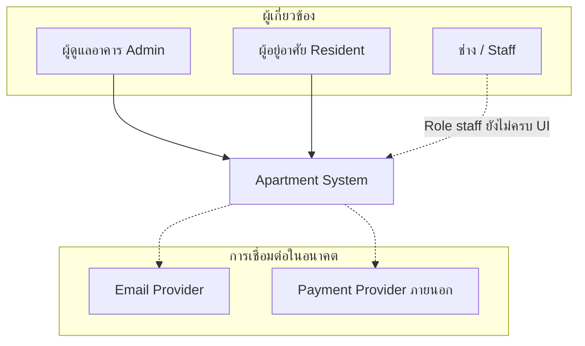

---

## 3. คอนเทนเนอร์และการสื่อสาร (C4 Level 2)

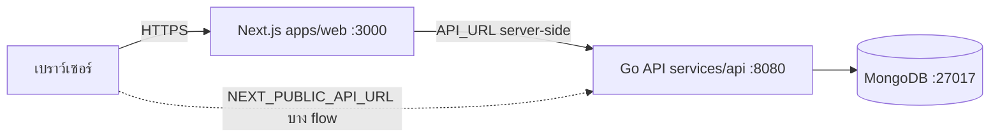

---

## 4. ความคืบหน้า Roadmap

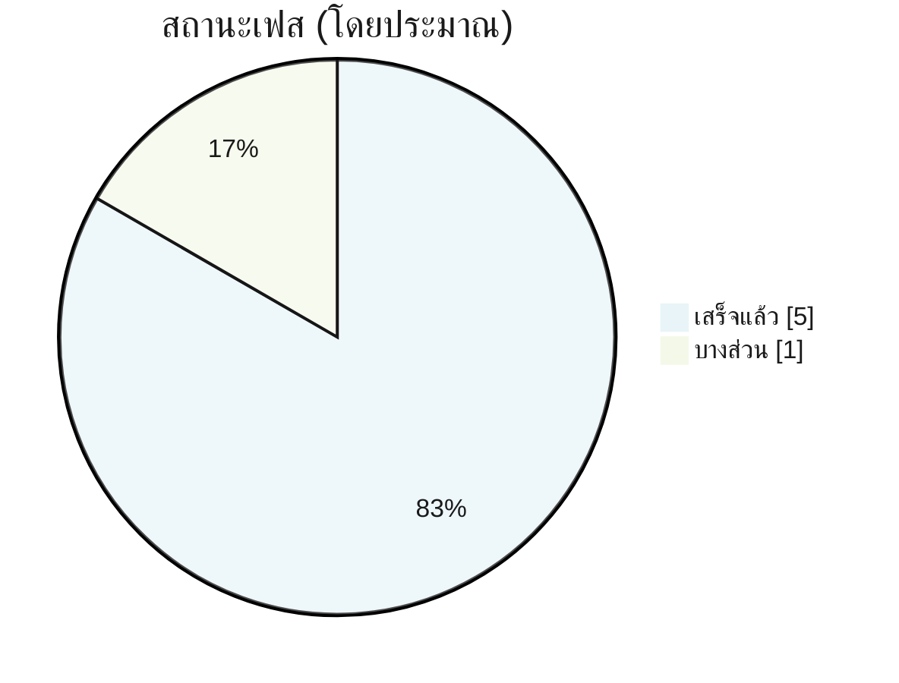

| Phase | เป้าหมาย | สถานะ |
|:-----:|----------|:-----:|
| 0 | Scaffold, health, Compose | ✅ |
| 2 | `/v1`, packages, errors | ✅ |
| 3 | Domain CRUD | ✅ |
| 4 | Auth JWT, RBAC | ✅ |
| 5 | Next.js product UI | ✅ |
| 6 | Tests, CI | ⚠️ บางส่วน |

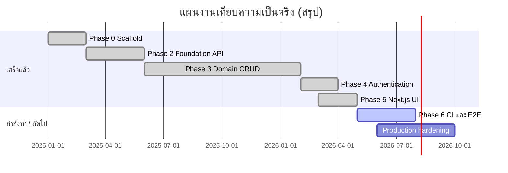

**เกินแผนเดิม:** wallet, invoice, billing ticker, self-service lease, rental periods, media upload

---

## 5. โครงสร้าง Monorepo

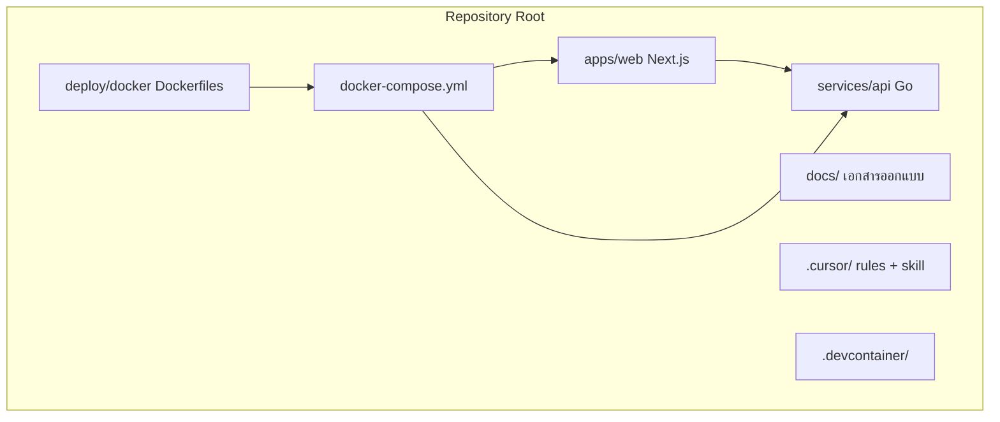

---

## 6. Go API — เลเยอร์ภายใน

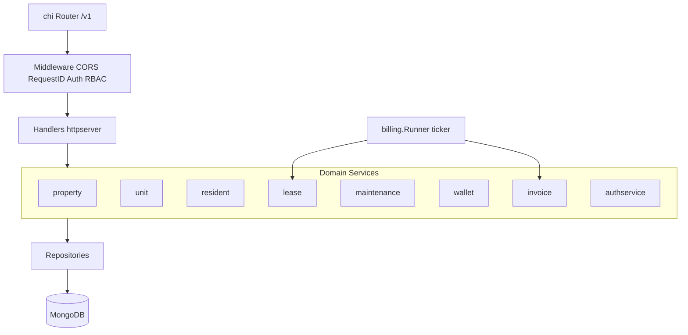

---

## 7. โมเดลข้อมูลหลัก (MongoDB)

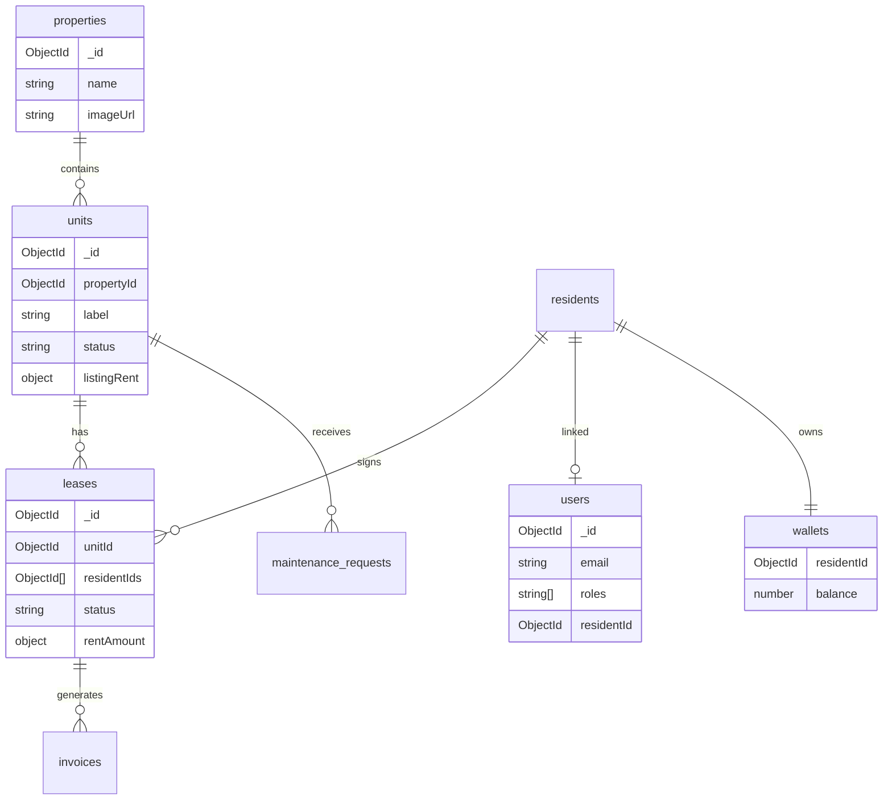

---

## 8. การยืนยันตัวตน (ลำดับจริง — ทำแล้ว)

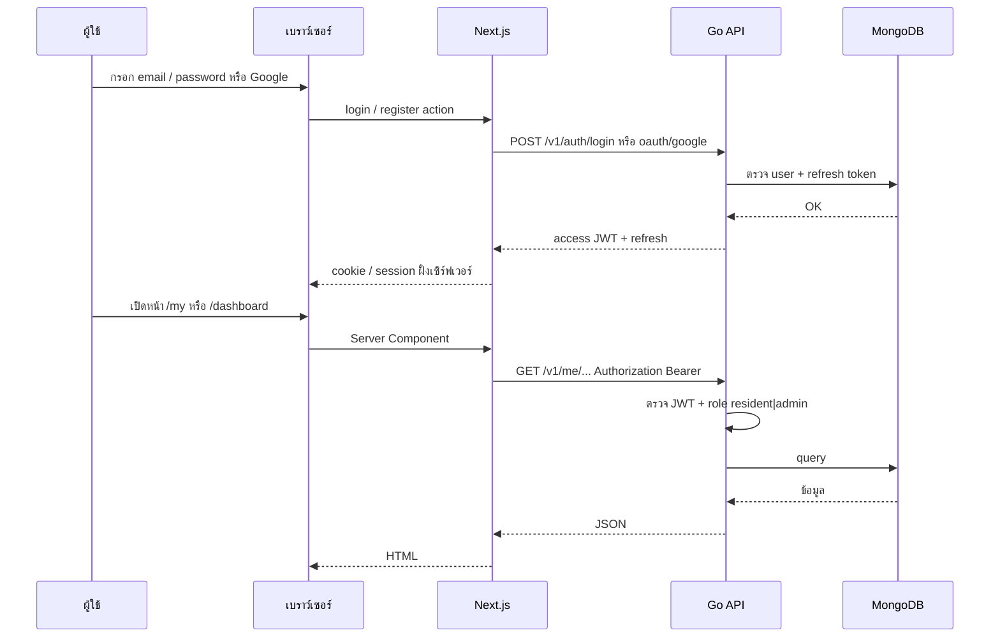

---

## 9. Self-service จองห้อง (ผู้อยู่อาศัย)

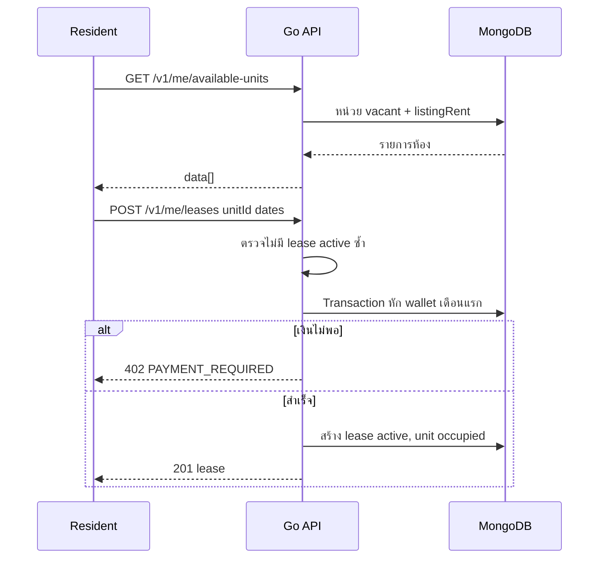

---

## 10. Billing รายเดือน (background)

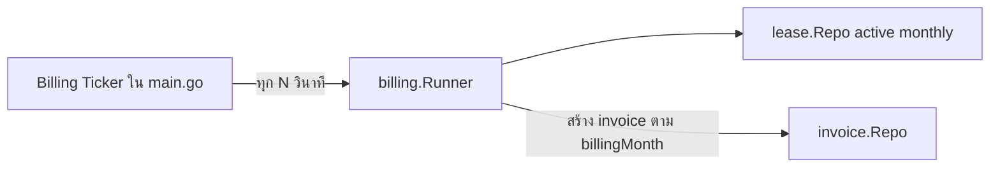

---

## 11. แผนผังหน้า Web (`apps/web`)

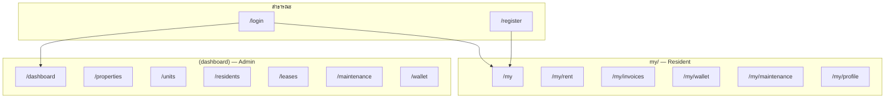

**i18n:** ภาษา `en` | `th` ผ่าน `next-intl` และ cookie `NEXT_LOCALE`

---

## 12. การ deploy — Docker Compose

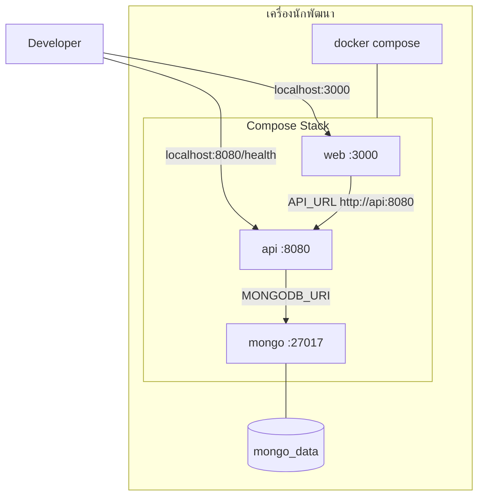

**ไฟล์ build:** `deploy/docker/Dockerfile.api`, `Dockerfile.web`

---

## 13. Dev Container (Cursor / VS Code)

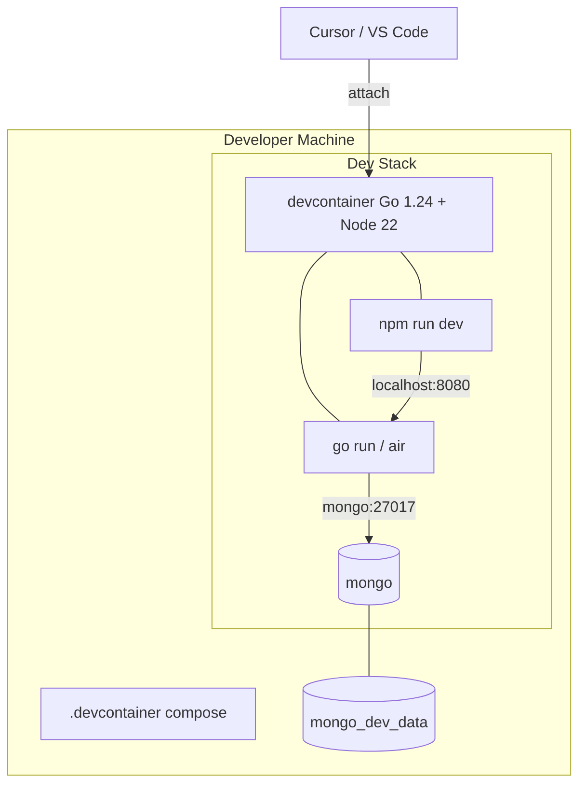

---

## 14. อนาคต Production (อ้างอิง — ยังไม่ implement)

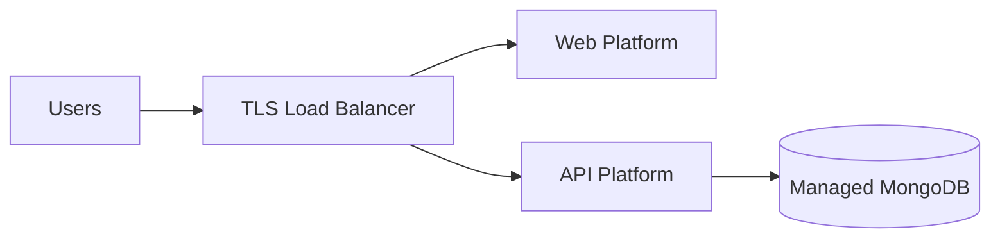

---

## 15. สรุป Backend API (กราฟ endpoint)

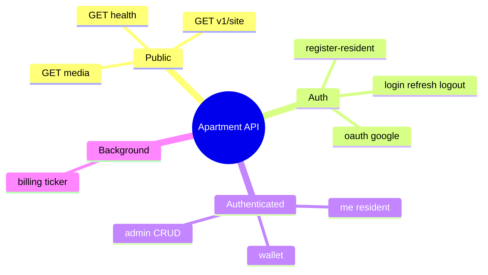

---

## 16. เครื่องมือพัฒนา AI — `.cursor/`

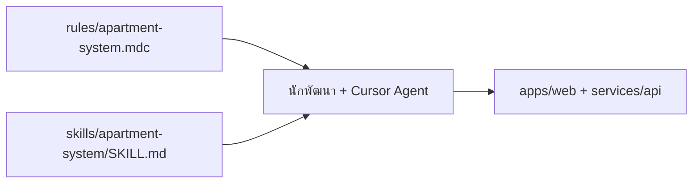

| รายการ | หน้าที่ |
|--------|---------|
| `apartment-system.mdc` | กฎ workspace: stack, design-first |
| `SKILL.md` | module map, Go layering, anti-patterns |

---

## 17. ช่องว่างและข้อเสนอถัดไป

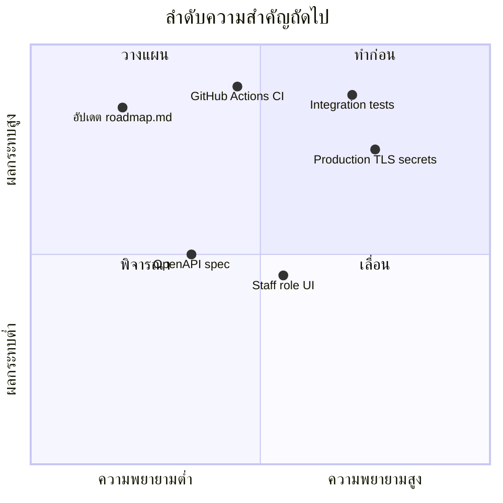

1. **อัปเดต `roadmap.md`** ให้ตรงโค้ดปัจจุบัน  
2. **CI:** `go test`, `npm run lint/build`, `docker compose build`  
3. **ทดสอบ:** integration + e2e (login → จองห้อง → wallet)  
4. **Production:** TLS, MongoDB auth, secrets จริง  
5. **`RoleStaff`:** workflow ช่างซ่อมเต็มรูปแบบ  

---

## 18. สรุปท้ายรายงาน

โปรเจกต์อยู่ในสภาพ **MVP ใช้งานได้**: API แบบเลเยอร์, auth + RBAC, CRUD ครบ, พอร์ทัล resident (จองห้อง, wallet, ใบแจ้งหนี้, แจ้งซ่อม), แอดมินแดชบอร์ด, สองภาษา EN/TH, Docker และ Dev Container พร้อมใช้

โฟกัสต่อไป: **คุณภาพและปฏิบัติการ** (CI, integration/e2e) และ **ซิงค์เอกสาร**

---

## เอกสารที่เกี่ยวข้อง

| ลิงก์ | คำอธิบาย |
|------|----------|
| [diagrams.md](./diagrams.md) | ไดอะแกรมสถาปัตยกรรมมาตรฐาน |
| [architecture.md](./architecture.md) | C4, ADR, security |
| [roadmap.md](./roadmap.md) | แผนเฟส (ควรอัปเดต) |
| [feature.md](./feature.md) | แคตตาล็อกฟีเจอร์ |
